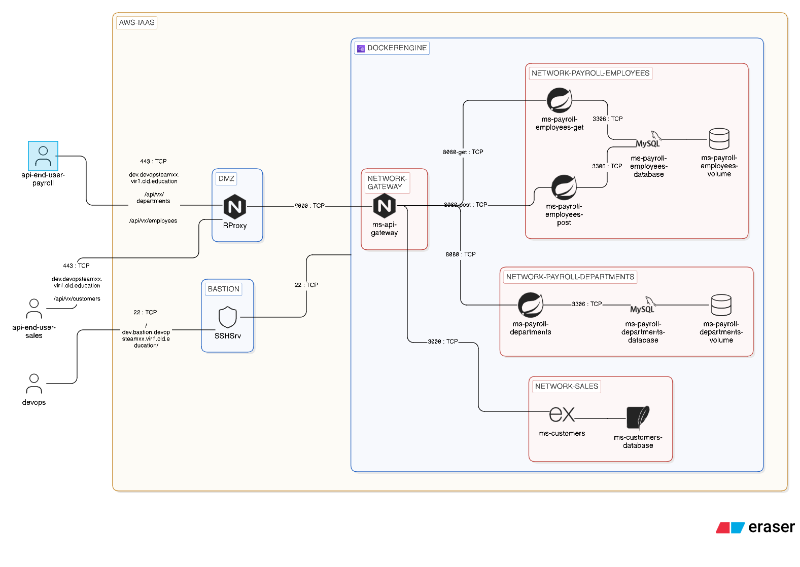

# Project

## Introduction

Ce projet a pour objectif d'entraîner le déploiement d'une infrastructure docker compose dans un environnement de "staging" tel que l'on pourrait le trouver dans un projet réel.

Les contraintes d'accès, les restrictions de droits et la collaboration avec un OPS seront ainsi expérimenté.

## Les rôles

Les techniciens sont impliqués dans des actions de détection de pannes, de debug et aident ainsi l'OPS a détecté la source d'erreur.

L'ops quant-à-lui sera responsable de déploier l'infrastructure (niveau IaaS), de livrer les accès aux techniciens et d'offrir un niveau de visiblité des différentes règles de sécurité pour aider le DEV à comprendre comment son infrastructure docker compose s'intègre au sein de l'IaaS.

Voici une vue d'ensemble de l'infrastructure IaaS et l'intégration du docker compose.



---


### BACKLOG

*Step 00 - Pris en main de l'infrastructure*

#### Prérequis

Chaque équipe dispose d'un canal teams. Au sein de ce canal une archive ayant cette structure a été livrée. Vous devez la récupérer en local.

* Structure de l'archive

```bash
├── ./connexion-bastion.sh                --> ouvre une connexion sur le bastion et prépare le tunnel ssh
├── ./connexion-docker-engine.sh          --> ouvre une connexion via le tunnel ssh du bastion vers le docker engine
├── ./devopsteam99-bastion-srv.pem        --> clé privée pour le bastion (ne pas la publier)
├── ./devopsteam99-docker-engine.pem      --> clé privée pour le docker-engine (ne pas la publier)
├── ./devopsteam99-docker-engine.pub      --> clé publique qui a été livrée sur le bastion, au sein de votre utilisateur
```
* Droits sur les clés

Il est imoportant que les clés soient privées, autrement dit que les permissions du système de fichier soient fixées comme suit:

   * 600 sur le dossier contenant les clés (seul le propriétaire peut lire et écrire)
   * 400 sur chacune des clés (limitation à votre utilisateur, en lecture seule)

* Erreur en lien avec les droits

```
@@@@@@@@@@@@@@@@@@@@@@@@@@@@@@@@@@@@@@@@@@@@@@@@@@@@@@@@@@@
@         WARNING: UNPROTECTED PRIVATE KEY FILE!          @
@@@@@@@@@@@@@@@@@@@@@@@@@@@@@@@@@@@@@@@@@@@@@@@@@@@@@@@@@@@
Permissions 0777 for 'devopsteam99-bastion-srv.pem' are too open.
It is required that your private key files are NOT accessible by others.
This private key will be ignored.
Load key "devopsteam99-bastion-srv.pem": bad permissions
devopsteam99@dev.bastion.vir1.cld.education: Permission denied (publickey).
```

* Avertissement lorsque l'empreinte de l'instance a changé

L'infrastructure AWS va être redéployée après chaque étape. Vous obtiendrez de votre client ssh un avertissement de ce type:

```
@@@@@@@@@@@@@@@@@@@@@@@@@@@@@@@@@@@@@@@@@@@@@@@@@@@@@@@@@@@
@    WARNING: REMOTE HOST IDENTIFICATION HAS CHANGED!     @
@@@@@@@@@@@@@@@@@@@@@@@@@@@@@@@@@@@@@@@@@@@@@@@@@@@@@@@@@@@
IT IS POSSIBLE THAT SOMEONE IS DOING SOMETHING NASTY!
Someone could be eavesdropping on you right now (man-in-the-middle attack)!
It is also possible that a host key has just been changed.
```

Pour nettoyer le fichier `know_hosts`, la commande suivante vous y aidera:

```
ssh-keygen -f '<yourPath>/.ssh/known_hosts' -R '[localhost]:9022'
```

#### Processus pour initier les connexions

* Se connecter au bastion

```
bash connexion-bastion.sh
```

```
//résultat attendu
devopsteamxx@ip-10-0-0-xx:~$ 
```

* Se connecter au docker-engine

!!!Le tunnel vers le bastion doit être maintenu, il s'agit d'ouvrir une deuxième session ssh!!!

```
bash connnexion-docker-engine.sh
```

```
//resultat attendu
admin@ip-10-0-xx-10
```

#### Intéragir avec docker

Docker a été installé en suivant les bonnes pratiques minimales requises en environnement productif.

* `sudo` devra être mentionné avant chaque commande
* les données exploitées par `docker` sont stockées sur un disque différent du système d'exploitation

``` 
lsblk
```

```
//resultat attendu
NAME         MAJ:MIN RM  SIZE RO TYPE MOUNTPOINTS
nvme1n1      259:0    0   15G  0 disk /docker          --> point de montage persistent du volume dédié à Docker
nvme0n1      259:1    0    8G  0 disk 
├─nvme0n1p1  259:2    0  7.9G  0 part /
├─nvme0n1p14 259:3    0    3M  0 part 
└─nvme0n1p15 259:4    0  124M  0 part /boot/efi
```

#### Valider le bon fonctionnement de Docker

Vous trouverez à la racine de l'hôte un répertoire `payroll-debug-session` contenant le nécessaire pour déployer notre projet `docker compose`.

* Récupération des dépendances et construction des images personnalisées

```
sudo docker compose build
```

```
//résulta attendu
[+] build 5/5
 ✔ Image payroll-debug-session-ms-payroll-employees-get  Built     1.9s
 ✔ Image payroll-debug-session-ms-payroll-employees-post Built     1.9s
 ✔ Image payroll-debug-session-ms-payroll-departments    Built     1.9s
 ✔ Image payroll-debug-session-ms-customers              Built     1.9s
 ✔ Image payroll-debug-session-ms-api-gateway            Built     1.9s
```

* Déploiement de la solution

```
sudo docker compose up -d
```

```
[+] up 7/7
 ✔ Container ms-payroll-employees-database   Healthy               2.2s
 ✔ Container ms-payroll-employees-post       Healthy              46.2s
 ✔ Container ms-payroll-departments-database Healthy               2.2s
 ✔ Container ms-payroll-departments          Healthy              46.2s
 ✔ Container ms-sales-customers              Healthy               7.2s
 ✔ Container ms-payroll-employees-get        Healthy              45.7s
 ✔ Container ms-api-gateway                  Started              46.1s
```

## Résultat à obtenir (après debug)

Note : résultat obtenu hors de l'environnement AWS

* Récupérer la liste des employées

```
curl -i -X GET dev.devopsteamxx.vir1.cld.education/api/v1/employees
```

```
HTTP/1.1 200 
Server: nginx
Date: Wed, 20 May 2026 13:11:54 GMT
Content-Type: application/json
Transfer-Encoding: chunked
Connection: keep-alive

[]                             --> liste vide
```

* Récupérer la liste des départements

```
curl -i -X GET dev.devopsteamxx.vir1.cld.education/api/v1/departments
```

```
HTTP/1.1 200 
Server: nginx
Date: Wed, 20 May 2026 13:11:54 GMT
Content-Type: application/json
Transfer-Encoding: chunked
Connection: keep-alive

[]                             --> liste vide
```


* Récupérer la liste des clients

```
curl -i -X GET dev.devopsteamxx.vir1.cld.education/api/v1/customers
```

```
HTTP/1.1 200 OK
Server: nginx
Date: Wed, 20 May 2026 13:14:47 GMT
Content-Type: application/json; charset=utf-8
Content-Length: 761
Connection: keep-alive
X-Powered-By: Express
ETag: W/"2f9-NDqpuLwtyTT4/CPc7/RKw6PSGU4"

[...]                          ---> liste contenant 4 clients
```
